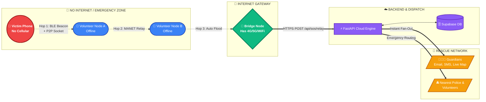
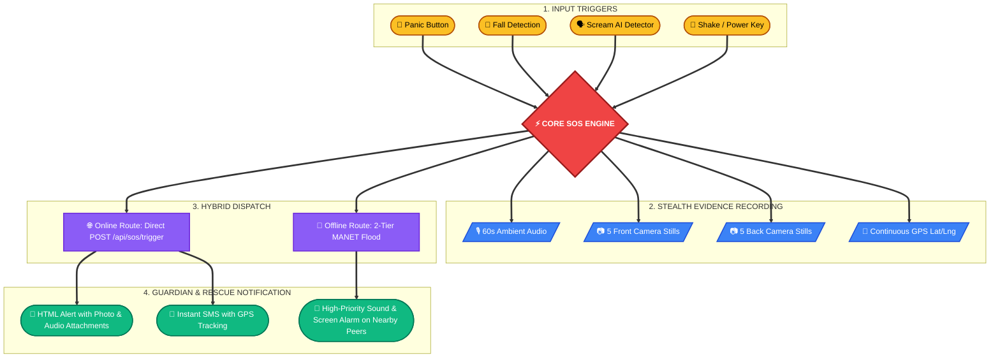

<p align="center">
  
</p>

<h1 align="center">
  🛡️ UYIRKAVAL (உயிர்காவல்) / NIRBHAY
</h1>

<p align="center">
  <em>"Even without internet, even in the darkest corner, her emergency signal will hop, travel, and survive — until help arrives."</em>
</p>

<p align="center">
  <strong>The World's First Native Hybrid MANET Offline Emergency Lifeline & Edge-AI Safety Network</strong><br/>
  <em>Dual-Tier Mesh Protocol (BLE Low-Latency Beacons + Wi-Fi Direct P2P) • On-Device AI Threat Detection • Stealth Evidence Capture</em>
</p>

<p align="center">
  <a href="https://github.com/anandkumar7722/Uyirkavals_final/graphs/contributors"></a>
  <a href="https://github.com/anandkumar7722/Uyirkavals_final/stargazers"></a>
  <a href="https://github.com/anandkumar7722/Uyirkavals_final/issues"></a>
  
  
  
  
  
  
</p>

---

## 📌 Table of Contents
- [🎯 The Problem \& Solution](#-the-problem--solution)
- [⚡ Live System Status](#-live-system-status)
- [🏗️ System Architecture](#️-system-architecture)
  - [1. Two-Tier MANET Offline Mesh Flow](#1-two-tier-manet-offline-mesh-flow)
  - [2. Multi-Modal SOS Pipeline](#2-multi-modal-sos-pipeline)
- [✨ Key Capabilities](#-key-capabilities)
  - [1. Zero-Connectivity MANET Mesh](#1-zero-connectivity-manet-mesh)
  - [2. Edge AI Autonomous Detection](#2-edge-ai-autonomous-detection)
  - [3. Stealth Multi-Source Evidence Recording](#3-stealth-multi-source-evidence-recording)
  - [4. Real-Time Dynamic Threat Scoring](#4-real-time-dynamic-threat-scoring)
  - [5. Instant Guardian \& Police Dispatch](#5-instant-guardian--police-dispatch)
- [🛠️ Technology Stack](#️-technology-stack)
- [📁 Project Directory Tree](#-project-directory-tree)
- [🚀 Quickstart \& Installation](#-quickstart--installation)
  - [Android Client Setup](#android-client-setup)
  - [FastAPI Backend Setup](#fastapi-backend-setup)
  - [Offline Mesh Verification](#offline-mesh-verification)
- [📡 API Reference](#-api-reference)
- [👥 Contributors \& Acknowledgments](#-contributors--acknowledgments)

---

## 🎯 The Problem & Solution

> **"What happens when a woman in danger has no mobile data or cellular network?"**

In high-risk scenarios — basements, parking structures, remote highways, transit tunnels, and rural dead zones — traditional safety apps fail completely because they rely strictly on active internet connections.

**Uyirkaval (Nirbhay)** resolves this fundamental vulnerability by introducing an **autonomous, zero-cloud Mobile Ad-hoc Network (MANET)**. The emergency beacon hops wirelessly between nearby phones via Bluetooth Low Energy and Wi-Fi Direct until it reaches any peer with internet connectivity, which immediately relays the alert, live location, and evidence to guardians and emergency responders.

```
┌─────────────────┐       ┌─────────────────┐       ┌─────────────────┐       ┌─────────────────┐
│  Victim Phone   │ ──►   │ Nearby Device 1 │ ──►   │ Nearby Device 2 │ ──►   │ Internet Bridge │ ──► Cloud Backend &
│  (Pure Offline) │ (BLE) │   (Offline)     │ (P2P) │   (Offline)     │ (TCP) │ (Has 4G/5G/WiFi)│     Guardians
└─────────────────┘       └─────────────────┘       └─────────────────┘       └─────────────────┘
```

---

## ⚡ Live System Status

| Component | Status | Details |
|---|---|---|
| 🌐 **Backend API** | `Operational` | [https://nirbhay-1.onrender.com](https://nirbhay-1.onrender.com) |
| 📖 **API Docs (Swagger)** | `Interactive` | [https://nirbhay-1.onrender.com/docs](https://nirbhay-1.onrender.com/docs) |
| 🗄️ **Database & Media Bucket** | `Connected` | Supabase PostgreSQL + Encrypted Media Storage |
| 📡 **Mesh Network Layer** | `Native Dual-Tier` | BLE Broadcaster (Phase 1) + Wi-Fi Direct TCP (Phase 2) |
| 🧠 **Edge ML Engine** | `On-Device` | Google YAMNet 521-Class TFLite Classifier |

---

## 🏗️ System Architecture

### 1. Two-Tier MANET Offline Mesh Flow



### 2. Multi-Modal SOS Pipeline



---

## ✨ Key Capabilities

### 1. Zero-Connectivity MANET Mesh
- **Phase-1 BLE Beaconing:** Ultra-low-power, sub-second broadcast containing GPS coordinates and emergency type without requiring Bluetooth pairing. Automatically transmits the real hardware phone model name for peer recognition.
- **Phase-2 Wi-Fi Direct Transport:** Reliable high-throughput peer-to-peer TCP channel for full packet delivery and multi-hop forwarding.
- **Smart AODV Flooding & Deduplication:** 30-second TTL LRU cache prevents duplicate broadcast storms and circular looping.

### 2. Edge AI Autonomous Detection
- **YAMNet Audio Classifier:** On-device neural network (521 sound classes) continually monitors audio streams for screams, distress cries, and violence without sending private audio to the cloud.
- **Bi-Phasic Fall Detection:** Multi-axis accelerometer algorithm detects initial free-fall (`< 0.3G`) followed by high-energy impact (`> 2.5G`) within 1000ms.

### 3. Stealth Multi-Source Evidence Recording
- Automatically captures **10 stealth photos** (5 front-facing + 5 rear-facing) with zero shutter sound or preview display.
- Records **60 seconds of high-fidelity ambient audio**.
- Continuously tracks and updates high-accuracy GPS coordinates.

### 4. Real-Time Dynamic Threat Scoring
```python
Risk_Score (0 - 100) = (
    Audio_Distress_Score  * 0.30 +
    Image_Threat_Score    * 0.25 +
    Location_Safety_Score * 0.20 +
    Trigger_Severity      * 0.15 +
    Battery_Depletion     * 0.10
)
```

### 5. Instant Guardian & Police Dispatch
- High-priority push notifications with direct **"📍 VIEW ON MAP"** actionable buttons.
- Multi-guardian email fan-out with captured photos and audio attachments embedded.
- SMS with live Google Maps coordinate links.

---

## 🛠️ Technology Stack

| Domain | Technologies |
|---|---|
| **Android Client** | Kotlin 2.0, Jetpack Compose, Material3, Coroutines, Room DB, WorkManager, CameraX |
| **Edge AI & Sensors** | TensorFlow Lite, YAMNet 521-Class Model, Android Sensor Framework |
| **Mesh Networking** | Bluetooth Low Energy (BLE Advertiser/Scanner), Wi-Fi Direct (`WifiP2pManager`), TCP Sockets |
| **Backend Framework** | Python 3.11+, FastAPI, Pydantic v2, Uvicorn, Gunicorn |
| **Cloud Infrastructure** | Supabase (PostgreSQL + Auth + Storage), Google Cloud Run / Render |
| **Alerting & Maps** | Gmail SMTP (HTML Email + Attachments), Fast2SMS API, Google Maps API |

---

## 📁 Project Directory Tree

```
Uyirkavals_final/
├── 📱 app/                                    # Android Native Application
│   ├── src/main/
│   │   ├── java/com/hacksrm/nirbhay/
│   │   │   ├── MainActivity.kt               # Main UI Host & Navigation Controller
│   │   │   ├── MainForegroundService.kt      # Core Safety Background Service
│   │   │   ├── FallDetectionService.kt       # Sensor Accelerometer Fall Engine
│   │   │   ├── ScreamDetectionService.kt     # YAMNet TFLite Microphone Engine
│   │   │   │
│   │   │   ├── Mesh/                         # MANET Mesh Subsystem
│   │   │   │   ├── MANETEngine.kt            # Central Mesh Coordinator & Flood Router
│   │   │   │   ├── BLEMeshLayer.kt           # Phase-1 Low-Latency BLE Beacon Layer
│   │   │   │   ├── WiFiDirectLayer.kt        # Phase-2 Wi-Fi Direct P2P TCP Layer
│   │   │   │   ├── MeshForegroundService.kt  # Persistent Mesh Service
│   │   │   │   ├── NearbyMesh.kt             # SOSPacket Data Model & Serializer
│   │   │   │   └── MeshSosSender.kt          # Mesh Outbound Dispatcher
│   │   │   │
│   │   │   ├── sos/                          # SOS Dispatch & Evidence Subsystem
│   │   │   │   ├── SOSEngine.kt              # Central SOS Orchestrator & Notifier
│   │   │   │   ├── RiskScoreEngine.kt        # Threat Calculation Engine
│   │   │   │   ├── SosPhotoCapture.kt        # Dual CameraX Background Capture
│   │   │   │   ├── AudioRecorder.kt          # 60-Second Audio Evidence Recorder
│   │   │   │   ├── AppDatabase.kt            # Room Database for Offline Persistence
│   │   │   │   └── UploadQueueWorker.kt      # WorkManager Offline-to-Cloud Sync
│   │   │   │
│   │   │   └── screens/                      # Jetpack Compose UI Screens
│   │   │       ├── HomeScreen.kt             # Panic Button & Dashboard
│   │   │       ├── ManageGuardiansScreen.kt  # Emergency Contacts Management
│   │   │       ├── SystemDiagnosticsScreen.kt# Real-Time Mesh & Sensor Diagnostics
│   │   │       └── Stealth_Dashboard/        # Stealth Emergency Navigation
│   │   │
│   │   └── assets/
│   │       └── yamnet.tflite                 # Pre-trained Edge AI Sound Model
│   └── build.gradle.kts                      # Gradle Dependencies & Config
│
├── ⚡ backend/                                # FastAPI Cloud Engine
│   ├── main.py                               # REST Endpoints (/trigger, /relay, /media)
│   ├── models.py                             # Request/Response Pydantic Models
│   ├── requirements.txt                      # Backend Dependencies
│   └── tests/                                # Automated Test Suites
│
├── 🔧 .github/workflows/
│   └── deploy.yml                            # Continuous Integration & Deployment
└── 📖 README.md                              # Complete System Documentation
```

---

## 🚀 Quickstart & Installation

### Android Client Setup

1. **Clone the Repository:**
   ```bash
   git clone https://github.com/anandkumar7722/Uyirkavals_final.git
   cd Uyirkavals_final
   ```

2. **Build the Debug APK:**
   ```powershell
   .\gradlew.bat assembleDebug
   ```

3. **Install on Connected Android Device:**
   ```powershell
   & "$env:LOCALAPPDATA\Android\Sdk\platform-tools\adb.exe" -d install -r "app\build\outputs\apk\debug\app-debug.apk"
   ```

---

### FastAPI Backend Setup

1. **Navigate to Backend & Create Environment:**
   ```bash
   cd backend
   python -m venv venv
   source venv/bin/activate       # On Linux/macOS
   # .\venv\Scripts\activate      # On Windows
   ```

2. **Install Dependencies:**
   ```bash
   pip install -r requirements.txt
   ```

3. **Create `.env` Configuration:**
   ```env
   SUPABASE_URL=https://your-project.supabase.co
   SUPABASE_SERVICE_ROLE_KEY=your-supabase-service-role-key
   GMAIL_USER=your-alert-sender@gmail.com
   GMAIL_APP_PASSWORD=your-16-character-app-password
   ```

4. **Launch Server:**
   ```bash
   uvicorn main:app --host 0.0.0.0 --port 8000 --reload
   ```

---

### Offline Mesh Verification

To verify that the offline mesh is working between two phones:

1. Install the APK on **Device A (Victim)** and **Device B (Volunteer/Receiver)**.
2. Turn **OFF** Wi-Fi and Mobile Data on Device A. Ensure **Bluetooth & Location** are **ON**.
3. Open the Nirbhay app on both devices.
4. Press the **SOS Button** on Device A.
5. **Device B** will instantly receive the beacon, sound an alarm, and show a high-priority notification:
   - **Device Name:** `📱 Victim Device: [Realme / Pixel / Galaxy Model]`
   - **Emergency Type:** `🚨 Panic SOS Button Pressed`
   - **Location:** Live coordinates with direct **"📍 VIEW ON MAP"** button.

---

## 📡 API Reference

| Method | Endpoint | Description |
|---|---|---|
| `POST` | `/api/sos/trigger` | Direct SOS alert dispatch (when online) |
| `POST` | `/api/sos/relay` | Ingests mesh-relayed packets from offline victims |
| `POST` | `/api/sos/media` | Multipart upload for captured photos and audio evidence |
| `POST` | `/api/sos/location` | Real-time GPS stream update during active emergency |
| `POST` | `/api/guardians` | Register new emergency guardian contact |
| `GET` | `/api/guardians/{user_id}` | Fetch all guardians for a victim |
| `POST` | `/api/sos/resolve` | Mark an emergency as safely resolved |

---

## 👥 Contributors & Acknowledgments

This project is built and maintained with ❤️ for empowering women's safety across India and worldwide.

- **GitHub Repository:** [anandkumar7722/Uyirkavals_final](https://github.com/anandkumar7722/Uyirkavals_final)
- **Contributors:** [View All Contributors](https://github.com/anandkumar7722/Uyirkavals_final/graphs/contributors)

---

<p align="center">
  <strong>Built with ❤️ • Protect Every Voice • Never Let Her Stand Alone</strong>
</p>
